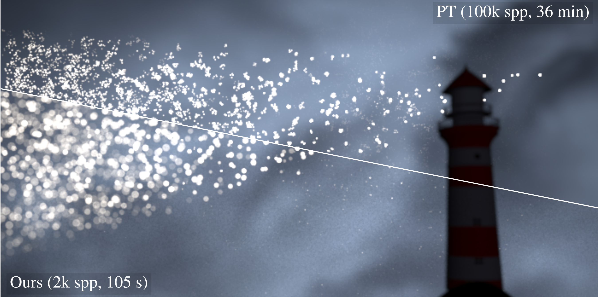
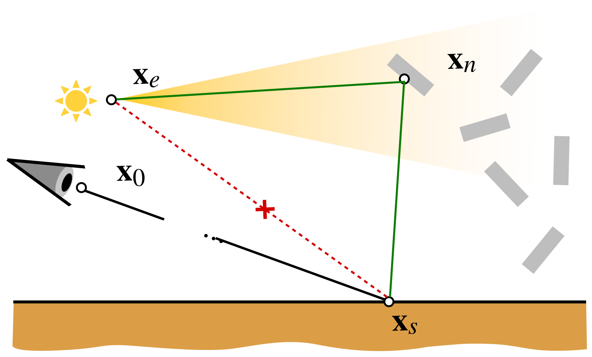
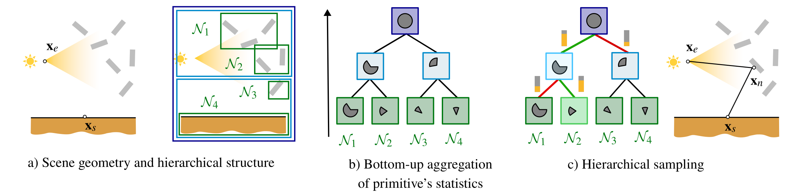
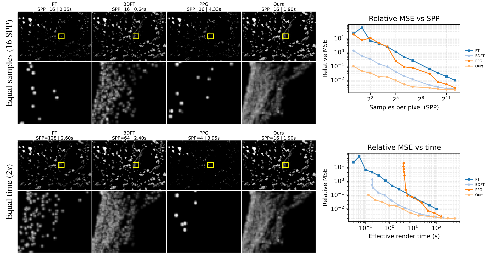

<p align="center">
  
</p>

# One-more-vertex Next-Event Estimation with Hierarchical Geometry Sampling

**Jorge Garcia-Pueyo\*, Nestor Monzon\*, Adrian Jarabo, Adolfo Muñoz**  
Universidad de Zaragoza, I3A, Spain &nbsp;·&nbsp; \*Equal contribution

*Eurographics Symposium on Rendering (EGSR) 2026 — Computer Graphics Forum, Vol. 45, No. 4*

[[Project page]](https://graphics.unizar.es/projects/OneMoreVertex26/) &nbsp;·&nbsp; [[Paper]](https://graphics.unizar.es/projects/OneMoreVertex26/)

---

## 1. Overview

Robust next-event estimation (NEE) remains a challenge in scenes characterized by sparse or small-scale geometry where indirect illumination is the primary transport mechanism. In these scenes, traditional path construction—which relies on local directional sampling—often fails to find intersections with the sparse geometry, and standard NEE also struggles as it typically connects vertices directly to emitters, failing when those connections are occluded or require intermediate bounces.

We propose a novel approach that constructs paths via **direct geometry sampling**. Instead of relying on stochastic ray casting, we repurpose the scene's bounding volume hierarchy (BVH) as a hierarchical sampling structure. By performing a stochastic top-down traversal, we transform the selection of the next path vertex into a hierarchical problem. To prioritize high-throughput connections, the traversal is guided by a proxy contribution function evaluated at each internal node, which leverages aggregated statistics of the geometry to efficiently estimate contribution during traversal.

We demonstrate orders of magnitude improvements in complex scenarios such as indirect illumination from sparse geometry or rendering discrete scattering media.

---

## 2. Method

The core idea is to insert one additional intermediate vertex **x**_n on the scene geometry **G** between a sensor vertex **x**_s and an emitter vertex **x**_e, forming a three-vertex subpath. This allows efficiently connecting paths where the geometry acts as a reflecting intermediary—handling scenes where direct connections from **x**_s to **x**_e fail due to occlusion or lack of visibility.

<p align="center">
  
</p>

> *Standard next-event estimation connects sensor vertex **x**_s directly to an emitter vertex **x**_e. In scenes where **x**_s is mostly illuminated through an indirect light from the scene geometry **G**, that direct connection has low to zero contribution (red dashed line). Our technique tackles this by importance-sampling an intermediate vertex **x**_n on the scene geometry **G**. This allows us to efficiently sample high-throughput indirect paths (green) where the geometry acts as the primary source of reflected illumination for **x**_s. Note that our approach accounts for the case where **x**_s is on the sensor **x**_s = **x**_0.*

Formally, we estimate the following integral over the scene geometry:

$$L(\mathbf{x}_s \leftrightarrow \mathbf{x}_e) = \int_\mathcal{G} f(\mathbf{x}_s \leftrightarrow \mathbf{x}_n \leftrightarrow \mathbf{x}_e)\, dA(\mathbf{x}_n)$$

where $f(\mathbf{x}_s \leftrightarrow \mathbf{x}_n \leftrightarrow \mathbf{x}_e)$ encodes the BSDF, geometry, visibility, and radiance terms along the three-vertex subpath.

To importance-sample **x**_n efficiently, we build a hierarchical structure over the scene primitives that aggregates directional, spatial, and material statistics at each BVH node. At render time, a stochastic top-down traversal selects a child node $\mathcal{N}_j^{d+1}$ from its parent $\mathcal{N}_i^d$ proportionally to an approximated importance weight:

$$p\!\left(\mathcal{N}_j^{d+1} \mid \mathcal{N}_i^d\right) = \frac{w\!\left(\mathcal{N}_j^{d+1},\, \mathbf{x}_s,\, \mathbf{x}_e\right)}{w\!\left(\mathcal{N}_i^d,\, \mathbf{x}_s,\, \mathbf{x}_e\right)}$$

This yields an O(log N) sampling cost per path vertex.

<p align="center">
  
</p>

> *Hierarchical One-more-vertex Sampling. (a) We wish to importance-sample high-throughput three-vertex subpaths between vertices **x**_s, **x**_e. Our method is based on a hierarchical structure of the scene primitives that (b) aggregates its directional, spatial, and material statistics (represented by the gray sectors) at each node bottom-up. (c) These statistics enable guiding the hierarchical sampling of the intermediate vertex **x**_n by evaluating the approximated per-node importance weight (yellow bars) for each node's children and choosing one proportionally to its weight.*

---

## 3. Results

<p align="center">
  
</p>

Comparison against path tracing (PT), bidirectional path tracing (BDPT), and practical path guiding (PPG) on the Asteroids scene. At equal samples (16 SPP) our method produces visibly cleaner results at a fraction of the time. At equal time (2 s) the gap is even more pronounced, with our method achieving orders-of-magnitude lower MSE on both the SPP and time convergence curves.

---

## 4. Quickstart

### Requirements

- [Docker](https://docs.docker.com/get-docker/) with Docker Compose

No other dependencies are needed on the host; everything is encapsulated in the container.

### 4.1 Docker build and compilation

Build the image and start the container:

```bash
docker compose build
docker compose up -d
```

Enter the container:

```bash
docker exec -it onemorevertexneehierarchicalgeometrysampling-mitsuba-1 bash
```

Inside the container, compile Mitsuba:

```bash
cp build/config-linux-gcc.py config.py
python2.7 $(which scons)
source setpath.sh
```

<details>
<summary>Building the PPG baseline (optional, needed for paper comparisons)</summary>

The practical path guiding (PPG) baseline requires a separate Mitsuba build inside the container:

```bash
ln -s /home/mitsuba/data /home/mitsuba/ppg/mitsuba/data
cd ppg/mitsuba
cp build/config-linux-gcc.py config.py
python2.7 $(which scons)
```

</details>

### 4.2 Reproduce paper results

From **outside** the container, run the full comparison pipeline for any experiment config:

```bash
bash scripts/experiments/comparison.sh scripts/experiments/ablation_asteroids4_smallerspotlight_ppg.yaml
```

This will render all technique variants, compute metrics (MSE, FLIP), and produce comparison figures and LaTeX assets under the output directory specified in the YAML. See [`scripts/experiments/README.md`](scripts/experiments/README.md) for the full pipeline documentation and config format.

### 4.3 Create your own scene and run it

Inside the container (after compiling and sourcing `setpath.sh`), render any scene XML directly:

```bash
mitsuba scenes/experiments/1_wildcard_spotlight/wildcard_spotlight_quads.xml
```

To use the one-more-vertex integrator in your own Mitsuba scene, add the following integrator block to your scene XML:

```xml
<integrator type="oneehgspath">
    <integer name="maxDepth" value="3"/>
</integrator>
```

---

## 5. Code changes

This repository is based on [Mitsuba 0.6](https://github.com/mitsuba-renderer/mitsuba). The paper's contributions are self-contained in the following new components:

| Path | Description |
|------|-------------|
| `src/geometrybvh/` | Core hierarchical geometry sampling module: BVH construction, per-node statistics fitting, importance weight computation, and stochastic traversal sampling |
| `src/integrators/oneehgspath/` | One-more-vertex path tracer integrator |
| `src/integrators/oneehgsptracer/` | One-more-vertex particle tracer integrator |
| `src/integrators/oneehgsptracermis/` | One-more-vertex particle tracer with MIS |

All other code is unmodified Mitsuba 0.6.

---

## 6. Citation

```bibtex
```
